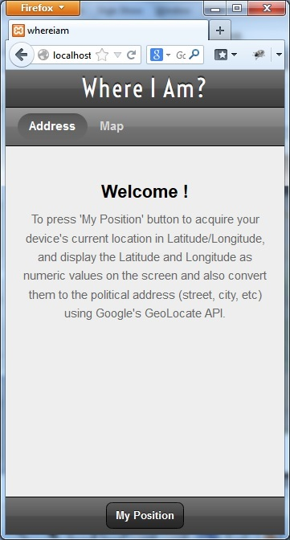
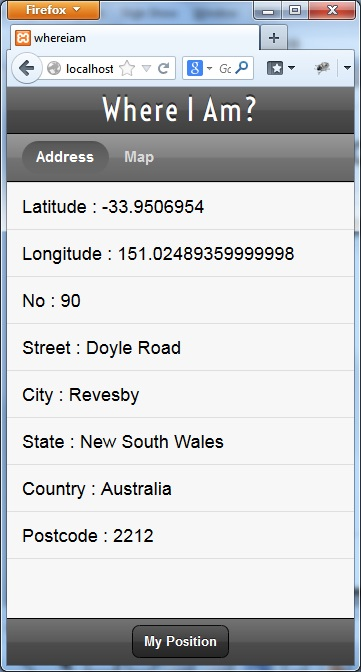
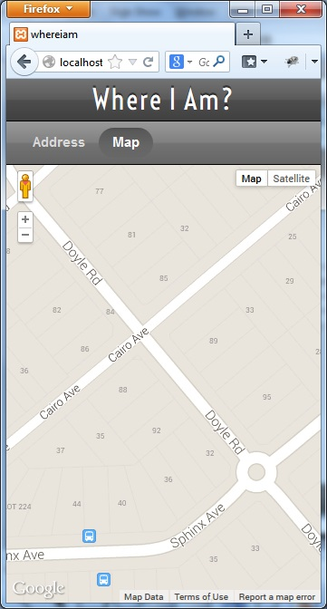

Sencha-Where-I-Am-App
===========================

One Sencha & Google Map Mobile App!

Please click <a href="http://demo.ebizdesigner.com/whereiam" target="_blank"> <b>Here</b> </a> to run this mobile app.

</img>&nbsp;
</img>&nbsp;
</img>&nbsp;

Main Features
- Develope platform: Sencha Architect -> Sencha Touch (2.*) and Sencha CMD
- Use HTML 5 Geolocation API to fetch device's geography address: latitude and longitude
- Use Google Map API to convert geo address to real world detail address: no, street/road, city, state, country, postcode
- Use Memory Proxy to read the newly created JSON data (the detail address) into Store and show them out on one data List
- The default Welcome Panel and detail address List are Card Layout children of their common Container, so as to be actived on reqired

Building Steps
<ol>
<li> Use Sencha Architect -> Sencha Touch to quickly build app: WhereIAm
<li> Use Sencha CMD to create one blank app and transplant WhereIAm app to the blank app
<li> Use Sencha CMD to build out its production app (Sencha Architect building process is too complex)
</ol>

Remaining Issues
- The production app's size is too big (1.07 MB) and need further optimization
- The building process of Sencha Architect is too complex and the result can not run normally
